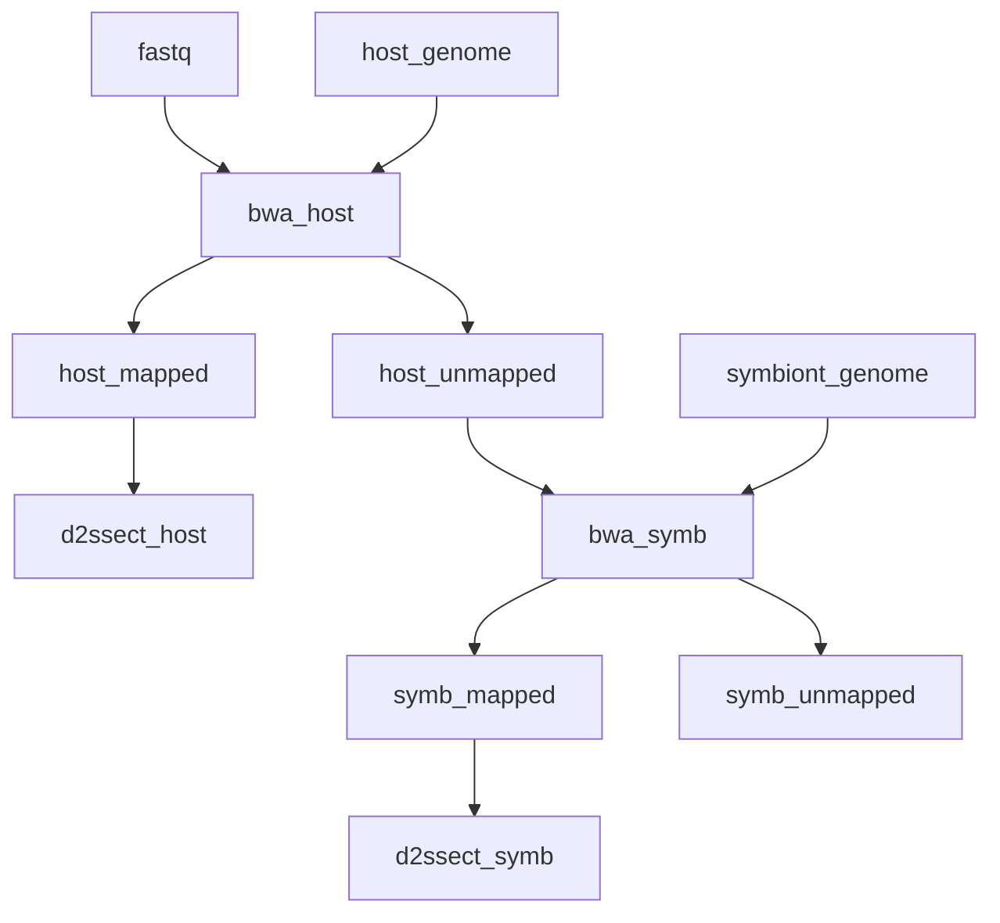

# Marine Omics d2s Pipeline

Rapidly generate a distance matrix between samples based on shared kmers in raw reads. This pipeline takes raw fastq files as input and will calculate `d2s`  (a normalised distance metric) based on shared kmers between all pairs of samples. If host and symbiont genomes are provided, reads will be filtered to target reads originating from host or symbiont.  The pipeline is ideally suited to clustering samples based on kmer profiles of reads from algal symbionts (family **Symbiodiniaceae**)

Input data can be from any type of sequencing (RNAseq, WGS, Radseq) but should be the same type across all samples.



## Installation

First install and configure [nextflow](https://www.nextflow.io/). See [here](https://gist.github.com/iracooke/bec2b24a86eb682f7d3055eea15e61aa) for instructions specific to JCU machines (zodiac, genomics1, genomics2)

Run a test to make sure everything is working. This test should work on a system with singularity installed.

```bash
nextflow run marine-omics/mod2s -profile singularity,test_pe -r main
```

## Quick Start

As a minimum, `mod2s` requires a set of raw read data (fastq files). Assuming you have raw data paths in a file named `samples.csv` you would run an analysis with;

```bash
nextflow run marine-omics/mod2s -profile zodiac -r main --samples samples.csv --outdir myout
```

Note the profile here is `zodiac` which will load predefined settings for the JCU HPC. Other alternatives include `genomics` or a custom profile that you create yourself with `-c custom.config`.

If you provide a host genome via the `--hostref` argument, `mod2s` will calculate d2s statistics based only on reads that map to the host;

```bash
nextflow run marine-omics/mod2s -profile zodiac -r main --samples samples.csv --hostref host.fasta --outdir myout
```

If you provide both a host and symbiont ref d2s will calculate two sets of d2s statistics, one for reads mapping to the host, and a second one for reads that do not map to host but do map to the symbiont ref

```bash
nextflow run marine-omics/mod2s -profile zodiac -r main --samples samples.csv --hostref host.fasta --symbref symbiont.fasta --outdir myout
```

#### Raw Data (samples.csv)

The paths to fastq files must be provided in `csv` format as in the example below;

```
sample,fastq_1,fastq_2
1,sample1_r1.fastq.gz,sample1_r2.fastq.gz
2,sample2_r1.fastq.gz,sample2_r2.fastq.gz
```

See [here](https://gist.github.com/iracooke/bec2b24a86eb682f7d3055eea15e61aa#file-samples-md) for more detail on the samples.csv format. 


#### Reference sequences (`hostref`, `symbref`)

Reference sequences should be provided in `fasta` format. 

If you are working with coral sequences you might be unsure of the correct reference to use for `symbref`.  A good place to start is to run the [moqc](https://github.com/marine-omics/moqc) pipeline which should give you an idea of the symbiont genus that is most dominant.  In the most common case this will be **Cladocopium** in which case a good choice for the reference sequence is the transcriptome available from [reefgenomics](http://symbs.reefgenomics.org/download/). 


## Outputs

Successful completion of the pipeline will produce outputs in the `<outdir>` you provided including;

	- *d2s* : Matrices of d2s distances for all pairs of samples. 

```R
# something in here to make an MDS plot
```

